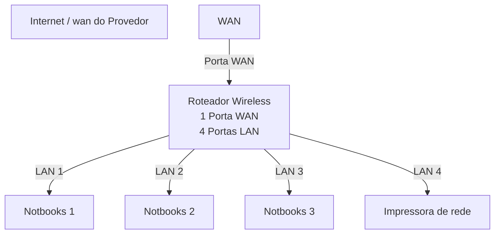
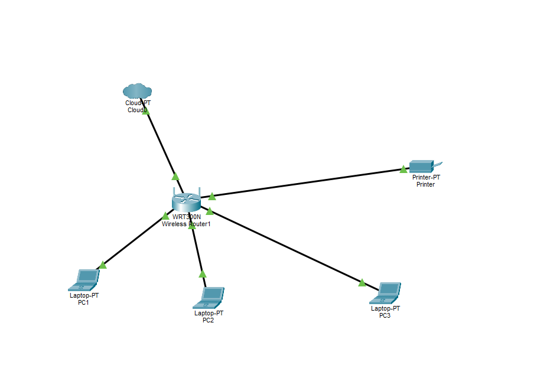

# Laboratório de Redes 01  - Projeto de Redes Local
Projeto desenvolvido na disciplina de redes de Computadores no Curso Técnico de Informatica do SENAC.

Aluno: Ezeqeuiel Soraes 

Professor: Jesé de Assis

Data: 09/03/2026

---

## 1. Objetivo
Implementar uma rede local simples conectado 3 notbooks a uma roteador wirwllwss com switch integrado e uma impresora de rede.

O projeto será realizado em duas etapas:

1. simulação da rede no Cisco Packet Tracer
2. Implementação da rede no laboratório real

---

## 2. Equipamento utilizados neste  laboratório

-3 notbooks
-1 roteador wireless com 1 porta wan e 4 portas Lan
-1 impressora de rede
- cabos de rede

---

## 3. Topologia da Rede
Diagrama lógico da rede utilizada nete laboratório:

Imagem da topologia utilizada no laboratório:

